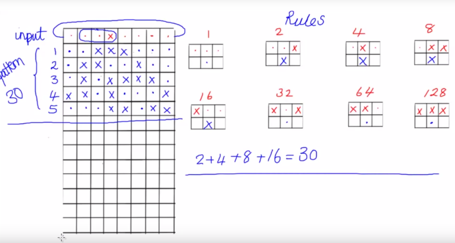

# Elementary Cellular Automaton
A one-dimensional cellular automata takes in a string, which in our 
case, consists of the characters '.' and 'x', and **changes it according 
to some predetermined rules**.

 The rules consider three characters, which 
are a character at position *k* and its two neighbours - *k-1,k+1* - and determine 
what the character at the corresponding position *k* will be in the new 
string.

For example, if the character at position *k* in the string  is **'.'** and 
its neighbours are **'.' and 'x'**, then the *pattern* is **'..x'**. We look up 
'..x' in the rules and replace the character at *k* with the replacement character in the corresponding pattern.

## Rules
| Value | Pattern in source string | Position *k* in new string | Contribution to pattern number (0 if replaced by '.' and value if replaced by 'x') |
|:-----:|:------------------------:|:------------------------:|:----------------------------------------------------------------------------------:|
| 1 | '...' | '.' | 1 * 0 |
| 2 | '..x' | 'x' | 2 * 1 |
| 4 | '.x.' | 'x' | 4 * 1 |
| 8 | '.xx' | 'x' | 8 * 1 |
| 16 | 'x..' | '.' | 16 * 0 |
| 32 | 'x.x' | '.' | 32 * 0 |
| 64 | 'xx.' | '.' | 64 * 0 |
| 128 | 'xxx' | 'x' | 128 * 1 |
|  |  |  | 142 |

## Pattern Number
To calculate the patterns which will have the central character 'x', work 
out the values required to **sum to the pattern number**. For example,
32 = 32 so only pattern 32 which is 'x.x' changes the central position to
an x. All the others have a . in the next line.


```
For pattern 142, and starting string:
...........x...........
the new strings created will be:
..........xx...........  (generations = 1)
.........xx............  (generations = 2)
........xx.............  (generations = 3)
.......xx..............  (generations = 4)
......xx...............  (generations = 5)
.....xx................  (generations = 6)
....xx.................  (generations = 7)
...xx..................  (generations = 8)
..xx...................  (generations = 9)
.xx....................  (generations = 10)
```
The **first position in the string is next to the last position**. This means that patterns **wrap** around, so if *k=0* (first character), its pattern is *k-1,k,k+1*. *k-1* is the **last** element in the string.

## Problem
Define a procedure , `cellular_automaton`, that takes three inputs:
* a non-empty string
* a pattern number which is an integer between 0-255 that represents a set of rules
* a positive integer, *n* which is the number of generations.

The procedure should return a string which is the result of applying the rules generated by the pattern to the string *n* times.

## Method
* Get patterns from pattern number
    * seperate method -> `get_patterns`
    * break given pattern number down into corresponding powers of 2 -> `split_power_2` method
* Loop through string *n* times, matching patterns and replacing characters
    * Get k-1,k,k+1
    * Compare to patterns
    * If match, replace k with new character from patter
* Return new string
### `cellular_automaton` method
```python
def cellular_automaton(source, pattern_num, n):
    result = ""
    patterns = get_patterns(pattern_num)
    for i in range(n):
        for k in range(len(source)):
            p = source[k-1]+source[k]+source[k+1]
            if p in patterns:
                result = source[:k] + patterns[p] + source[k+1:]
    return result
```

### `get_patterns` method
```python
def get_patterns(pattern_number, ruleset)
    numbers = split_power_2(pattern_number)
    rules = {}
    for n in numbers:
        rules[n] = ruleset[n]
    return rules
```

### `split_power_2` method
* Loop from 1 to input number
* AND i with input
    * if i & input == 1
        * add to result list
* Increase i to next power of 2 (left bitshift 1)

```python
def split_power_2(x):
    split_powers = []
    i = 1
    while i <= x:
        if i & x: # 1 or 0 -> evaluate as True/False
            split_powers.append(i)
        i <<= 1
    return split_powers
```