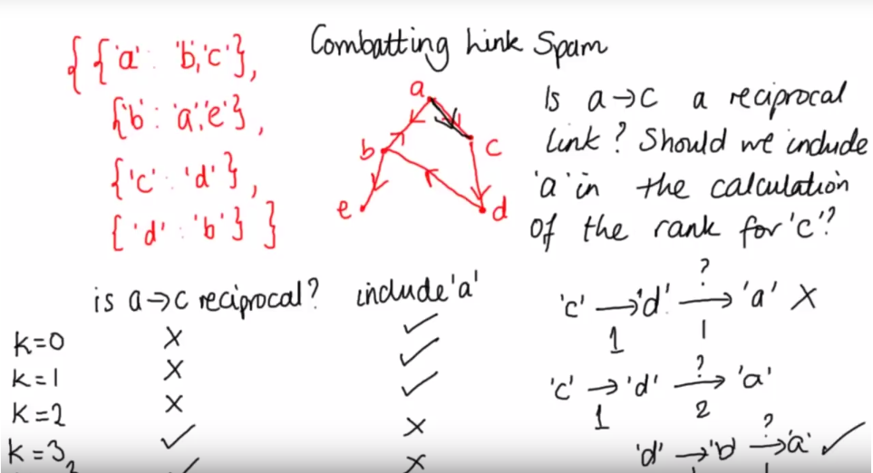

# Combatting Link Spam
One of the problems with the page ranking system for `web_crawler.py` is pages can 
collude with each other to improve their page ranks. We consider 
A->B a **reciprocal** link if there is a link path from B to A of length 
equal to or below the collusion level, k. The length of a link path 
is the number of links which are taken to travel from one page to the 
other.

*k* represents the **maximum distance** of a path from any node to determine if it is reciprocal i.e. if the node *cannot* be returned to within distance *k*, then it **is not** reciprocal. 

## Example
If `k = 0`, then a link from `A to A` is a reciprocal link for node A, 
since no links needs to be taken to get from A to A.

If `k=1`, B->A would count as a reciprocal link  *if* there is a link 
A->B, which includes one link and so is of length 1. (it requires 
two parties, A and B, to collude to increase each others page rank).

If `k=2`, B->A would count as a reciprocal link for node A if there is
a path A->C->B, for some page C, (link path of length 2),
or a direct link A-> B (link path of length 1).



## Problem
Modify the existing `compute_ranks` method to:
* Take an extra input *k*, which is a non-negative integer representing the collusion level.
* Exclude reciprocal links of length up to and including k from the page rank.

### Current `compute_ranks` method
```python
def compute_ranks(graph):
    d = 0.8  # damping factor
    numloops = 10  # number of times through relaxation

    ranks = {}
    # Initialize ranks
    npages = len(graph)
    for page in graph:
        ranks[page] = 1.0 / npages

    for i in range(0, numloops):
        newranks = {}
        for page in graph:
            rank = (1 - d) / npages
            for node in graph:
                if page in graph[node]:
                    rank += d * ranks[node] / len(graph[node])
            newranks[page] = rank
        ranks = newranks
    return ranks
```

### Method
* Before calculating ranks, traverse the graph from each node up to distance *k*.
    ```python
    def is_reciprocal(graph, source, destination,k):
        if k == 0:
            if destination == source:
                return True
            return False
        if source in graph[destination]:
            return True
        for node in graph[destination]:
            if is_reciprocal_link(graph, source, node, k-1):
                return True
        return False
    def compute_ranks(graph):
    d = 0.8  # damping factor
    numloops = 10  # number of times through relaxation

    ranks = {}
    # Initialize ranks
    npages = len(graph)
    for page in graph:
        ranks[page] = 1.0 / npages

    for i in range(0, numloops):
        newranks = {}
        for page in graph:
            rank = (1 - d) / npages
            for node in graph:
                if page in graph[node]:
                    if not is_reciprocal(graph, node, page, k):
                        rank += d * ranks[node] / len(graph[node])
            newranks[page] = rank
        ranks = newranks
    return ranks
    ```
