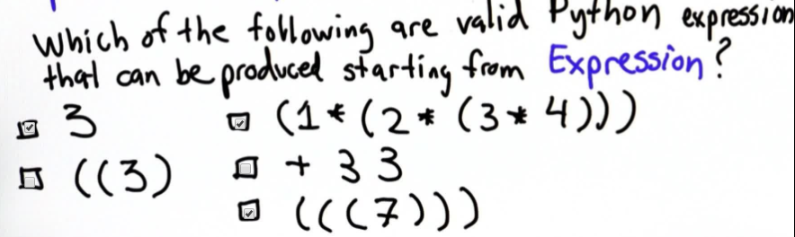
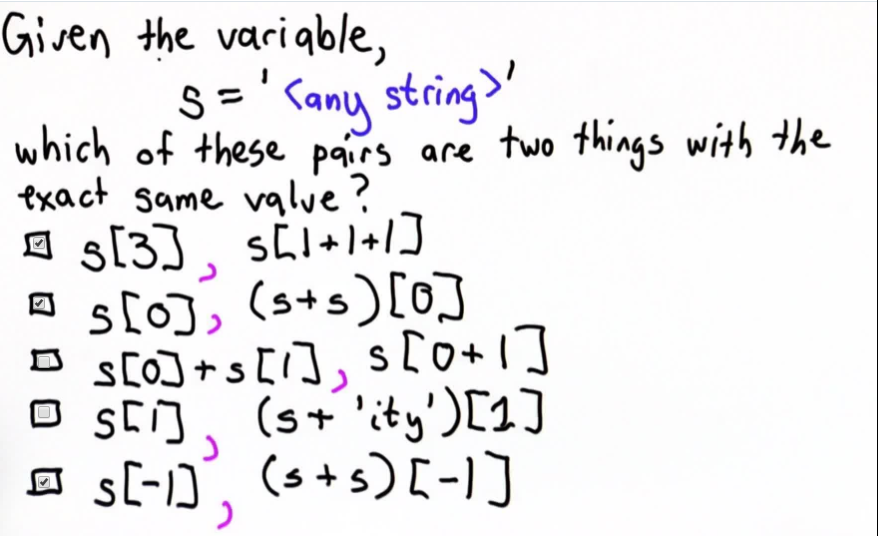

# Grammar

## Backus-Naur Form
* \<non-terminal> -> Replacement  
* Continue replacements until no non-terminals left
* **Expression** = Something that has a value

## Python Grammar Subset Example
* Expression -> Expression Operator Expression
* Expression -> Number
* Operator -> +
* Operator -> + *
* Number -> 0,1
* Expression -> (Expression)

## String Indexing
`s= '<any string>'` means that the pairs of answers must be equal for **every** possible string you could make `s` equal to.

