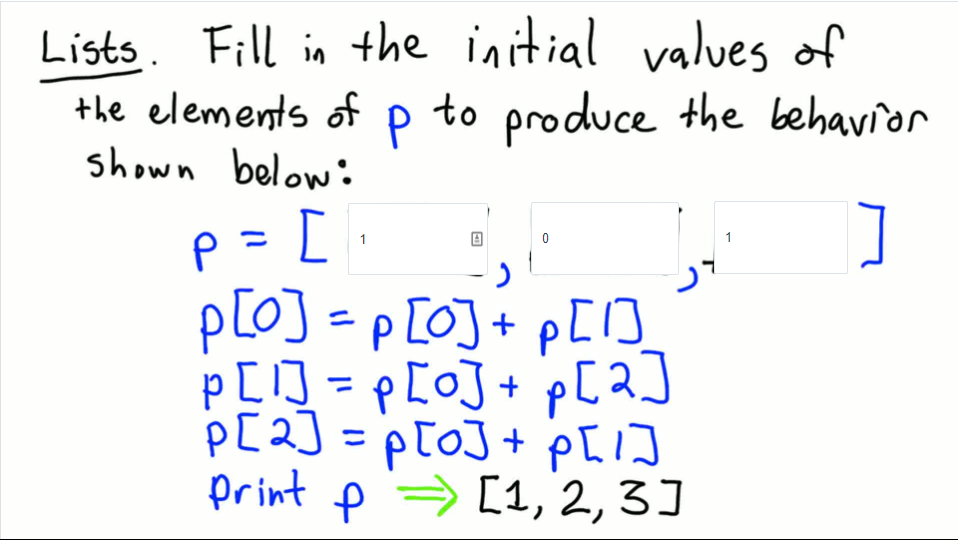
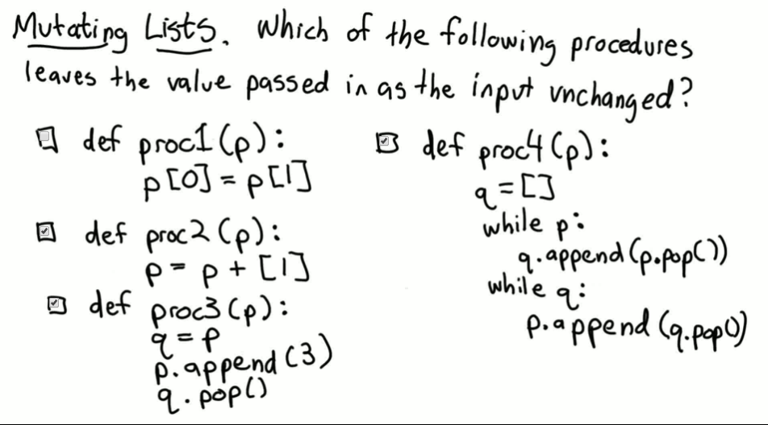

# Managing Data

Aliasing:
* Different variable names referring to same object
* Both variable names will show same changes to object -> lists/arrays

## Lists Exercises
* List concatenation creates a **new** list in current scope -> not reference

