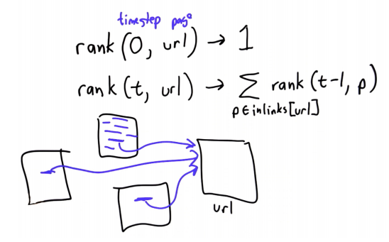
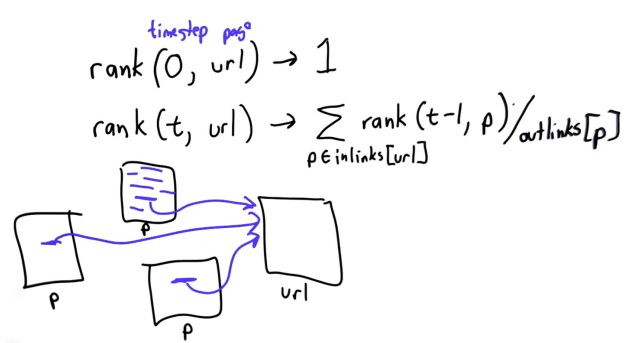

# Page Rank
Links on the web are analagous to friendships in the popularity model. Links from certain pages should 'count for more' than links from others.
* Integrity of links i.e. link from BBC news > Joe Smiths Facebook Page

Using a random web surfer, starting at a random page, the popularity of a page is **the probability that the random surfer reaches a particular page**.

Ranking is defined recursively over time (relaxation method, similar to friendship problem).
* At `t=0`, rank of a url = 1
* At time **t**, the rank of a url is the **sum of the ranks for all pages linkning to that url**.

**Inlinks** = Pages *linking in* to a particular url.

**Outlinks** = Pages *linked to* from a particular page.

Ranking is also **weighted**, such that the rank contributed by a page is **inversely weighted** by the number of outlinks from that page.
* Divide each rank in the sum by the number of outlinks from that page.
* i.e. the more links a page has, the less value each link contributes.

## Damping Factor
A web surfer who is randomly clicking links will eventually stop clicking. 

Damping factor/constant, *d* = the probability that, *at any step*, the surfer will **continue** clicking links.
* It is generally assumed that d=0.85
* How frequently the random web surfer will pick a random link vs starting over again on a new random page.