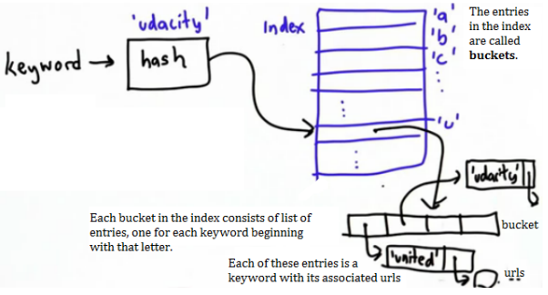
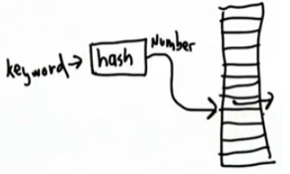

# Faster Lookups
Looping through an entire data structure/index is *slow* and (for the worst case) increase linearly with the size of the index.

## Hash Function
Given a keyword, hash function will map a keyword to a number, which is the position in the index where you should look for the keyword. Prevents the need to search the entire index.

### Using Buckets
Using a hash funciton based on one part (i.e. first letter) of the input keyword. The hash will produce and index which corresponds to all items with that same part (i.e. first letter). 

This is **Not the best way**. Time for searching is reduced but *not* significantly. Each bucket will still need to be searched item by item. Also, some buckets may have more items in than others making for unpredictable lookup time. For example, using the first letter of the keyword, the lookup time *could* be redced by a factor of 26 at best. However, buckets corresponding to word beginning with 'S' or 'T' are likely to contain more items than those for 'X' OR 'Q'. 

## Hash Table
* Hash function depends on the entire keyword.
* Even distribution of items between buckets.

Built in to Python as **dictionaries**.

