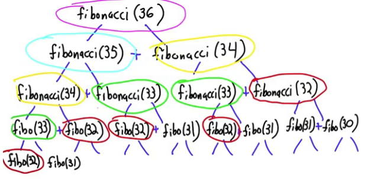

# Fibonacci Sequence
Integer sequence where every number after the first 2 is the sum of the two preceding ones. 

First two numbers are either 1,1 or 0,1.

Defined by:

F<sub>n</sub> = F<sub>n-1</sub> + F<sub>n-2</sub> ...

with seed values:
F<sub>1</sub> = 1, F<sub>2</sub> = 1
F<sub>1</sub> = 0, F<sub>2</sub> = 1

## Recursive Definition
`fibonacci(n)`

Base Cases:
* `fibonacci(0) = 0`
* `fibonacci(1) = 1`

Recursive Case:
* `fibonnaci(n) = fibonacci(n-1) + fibonacci(n-2)` where n > 1

```python
def fibonacci(n):
    if n == 0 or n == 1:
        return n
    else:
        return fibonacci(n-1) + fibonacci(n-2)


```
## Counting Calls


The above method requires a lot of duplicate, redundant computation. The number of times a each value of n must be computed actually follows the fibonacci sequence:
* `fibonacci(32)` -> 5 times.
* `fibonacci(33)` -> 3 times.
* `fibonacci(34)` -> 2 times.
* `fibonacci(35)` -> 1 time.
* `fibonacci(36)` -> 1 time

## Iterative Definition
* While loop
* Track previous two numbers
```python
def fibonacci(n):
    if n == 0 or n == 1:
        return n

    result = 0
    prev2 = 0
    prev1 = 1
    i = 2
    
    while i <= n:
        result = prev2 + prev1
        prev2 = prev1
        prev1 = result
        i += 1
    return result
```