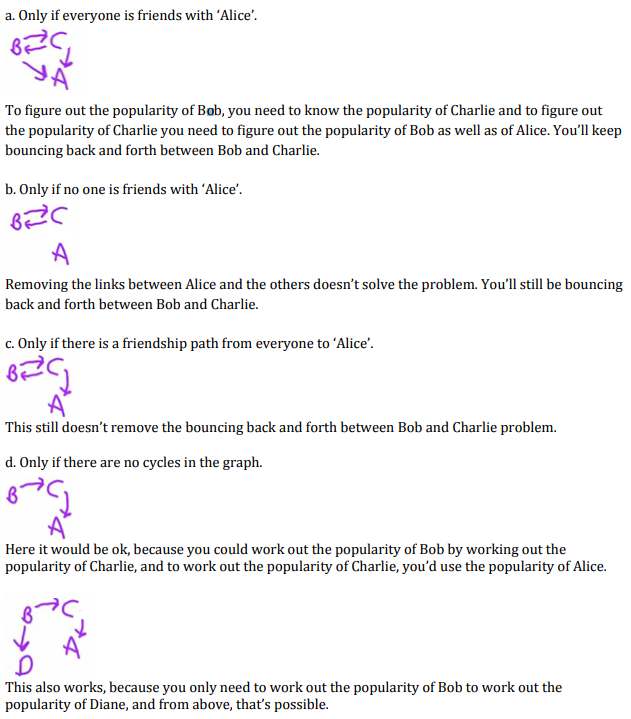
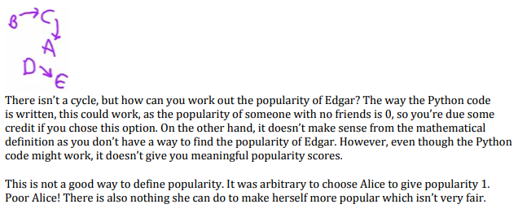

# Relaxation Algorithms
Method for solving systems of equations. Can be used to produce recursive definitions where no clear base case is present.
* Popularity of people:
    * popularity(p) = sum(popularity(friends of p))
    * This is a *circular* definition, and thus will never stop.
    * There is also no practical constraint to place on the definition to produce a base case:
        
        

## Basic Relaxation
Having a **starting** point is the equivalent of having a stopping point in recursive definitions.
```
start with a guess
while not done:
    make the guess better
```
### Popularity Problem
Introduce a **time step** parameter:
* t = time step
* p = person

Base case:
* `popularity(0,p) = 1`

Recursive case:
* `popularity(t,p) = sum(popularity(t-1,f))`
    * Where t>0, f = set of friends(p)

```python
def popularity(t,p):
    if t == 0:
        return 1
    else
        score = 0
        for f in friends(p)
            score += popularity(t-1,f)
        return score
```
Passing `t-1` to the recursive case means that t will **always** reach 0 eventually and thus the recursion will terminate. Using relaxation guarantees a good recursive definition (it always terminates), however **does not guarantee a meaningful definition of the problem.**
