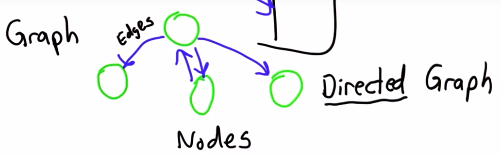
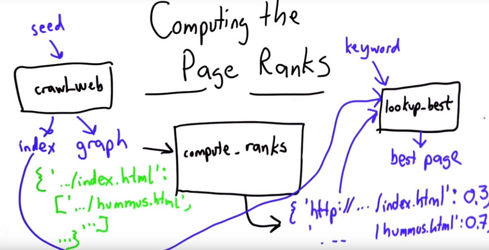

# Implementing URank
Page Rank is a registered trademark, so this implementation is **URank**.

## Keeping track of pages
Need to keep track of which pages link to which pages. Use a **directed graph** - data structure where nodes are linked to other other nodes, and links only go one way.



The directed graph can be represent using a 
dictionary:
* Key = url, value = [outlinks]
* For the above example:
    ```python
    graph = {'A':['B', 'C', 'D'],
                'B': [],
                'C': ['A'],
                'D': []
            }
    ```
* The graph gives a **mapping** from each node to the pages that it links to.
## Building the Link Graph
Need to modify the `crawl_web()` function from previous unit to produce **both** an index *and* a graph:
* `crawl_web(seed) -> index, graph`

### Current `crawl_web()` 
```python
def crawl_web(seed):
    tocrawl = [seed]
    crawled = []
    index = {}
    while tocrawl:
        page = tocrawl.pop()
        if page not in crawled:
            content = get_page(page)
            add_page_to_index(index, page, content)
            links = get_all_links(content)
            union(tocrawl, links)
            crawled.append(page)
    return index

```

## `crawl_web()` with Graph
```python
def crawl_web(seed):
    tocrawl = [seed]
    crawled = []
    index = {}
    graph = {}
    while tocrawl:
        page = tocrawl.pop()
        if page not in crawled:
            content = get_page(page)
            add_page_to_index(index, page, content)
            outlinks = get_all_links(content)
            graph[page] = outlinks
            union(tocrawl, outlinks)
            crawled.append(page)
    return index, graph
```
## Computing the Page Ranks


### Calculations
Ranking function:
* `rank(0,url) = 1/npages`
* `rank(t,url) = (1-d)/npages + sum(d*rank(t-1,p)/# outlinks from p)`
    * where:
        * p = set on inlinks to url
        * d = damping factor = 0.8
        * npages = total number of pages in the corpus
```python
rank(0, url) = 1/npages
rank(t, url) = (1-d)/npages +
    sum([for each page 'p' that links to URL,
        d*rank(t-1, p)/(number of outlinks from p)])
```

Iterative solution:
* Fibonacci sequence kept track of **current, next** values.
* Need **two dictionaries**:
    * ranks -> dict of ranks at time t-1
    * new_ranks -> dict of ranks at time t
        * 'Working space' for each time step.

Ranking function using rank/new_rank dictionaries:
* `rank(0,url) = 1/npages`
* `newranks[url] = (1-d)/npages + sum(d*ranks[p]/# outlinks from p)`

```python
rank(0, url) = 1/npages
newranks[url] = (1-d)/npages +
    sum([for each page 'p' that links to URL,
        d*ranks[p]/(number of outlinks from p)])
```

